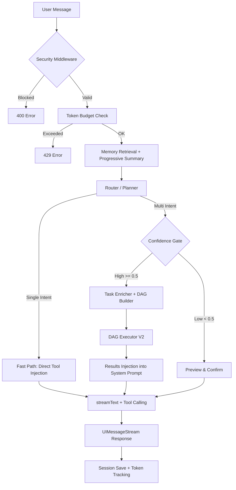

# Comprehensive AI Assistant Architecture & Report

This document serves as the master blueprint and analysis report for the Restaurant AI Assistant, covering both the **Guest AI** and **Admin AI**.

---

## I. Current System Architecture & Capabilities

The AI Assistant is a production-grade **Multi-Agent System** with intent routing, parallel DAG execution, human-in-the-loop (HITL) safety, progressive memory, and hybrid RAG search.

### 1. Technology Stack

| Layer                | Technology                                                                                                                                    |
| -------------------- | --------------------------------------------------------------------------------------------------------------------------------------------- |
| **AI Orchestration** | [Vercel AI SDK v6](https://sdk.vercel.ai/) (`generateObject`, `streamText`, `createUIMessageStream`, `convertToModelMessages`, `stepCountIs`) |
| **LLM Provider**     | [OpenRouter](https://openrouter.ai/) → Google Gemini 2.5 Flash                                                                                |
| **RAG & Vector DB**  | ChromaDB + Jina AI embeddings (`jina-embeddings-v3`) for menu & FAQs                                                                          |
| **Data Validation**  | Zod (strict JSON schemas for AI tool I/O, router outputs, and planner schemas)                                                                |
| **Database**         | Prisma ORM (PostgreSQL/SQLite)                                                                                                                |
| **Server**           | Fastify (with `reply.hijack()` for raw streaming)                                                                                             |
| **Client**           | Next.js + `@ai-sdk/react` (`useChat` hook, `DefaultChatTransport`)                                                                            |

### 2. The Multi-Agent Architecture

Both Guest and Admin AI utilize a **Planner → Enricher → DAG Executor → Synthesizer** pipeline.

#### A. Guest AI (`ai-chat.service.ts`)

**1. The Planner (`ai-router.service.ts`)**

- Uses `generateObject()` with `TaskPlanSchema` to decompose user input into 1–4 atomic tasks.
- 9 supported intents: `search_product`, `search_faq`, `place_order`, `cancel_order`, `apply_coupon`, `get_order_status`, `get_restaurant_info`, `get_available_coupons`, `general_chat`.
- Outputs: task list, confidence score, dependency graph, `isMultiIntent` flag.
- Fast-path: single intent → maps to legacy `AgentIntent` (`SEARCH`, `ORDER`, `FAQ`, `GENERAL`) for tool selection.
- Fallback-safe: `GENERAL` intent provides **all** tools so the LLM can self-route.

**2. The Agents (Specialized Tool Groups)**

| Agent      | File              | Tools                                                                                         | Key Capabilities                                                                                                                |
| ---------- | ----------------- | --------------------------------------------------------------------------------------------- | ------------------------------------------------------------------------------------------------------------------------------- |
| **Search** | `search.agent.ts` | `searchMenu`, `searchMenuSemantic`, `getDishDetails`, `getMenuCategories`, `getPopularDishes` | 5-layer Hybrid RAG pipeline (Normalize → Entity Extract → Expand → Hybrid Retrieve → Rerank); SQL fallback on RAG failure       |
| **Order**  | `order.agent.ts`  | `getOrderStatus`, `getAvailableCoupons`, `placeOrder`, `cancelOrder`, `applyCoupon`           | HITL on mutations — `placeOrder`, `cancelOrder`, `applyCoupon` have **no `execute`** handler (frontend renders confirmation UI) |
| **FAQ**    | `faq.agent.ts`    | `getRestaurantInfo`, `searchFAQ`                                                              | 4-layer lightweight hybrid search pipeline; SQL fallback                                                                        |

**3. The Executor (`task-executor.ts`, 722 lines)**

- **DAG Builder:** Constructs dependency graph from planner suggestions + implicit read-before-write rules.
- **Cycle Detection:** DFS-based. Falls back to sequential on cycles.
- **Parallel Grouping:** Hybrid whitelist + resource-based auto-detect for parallel-safe task pairs.
- **State Forwarding:** Injects prior task results into dependent tasks. V3: auto-picks when exactly 1 search result.
- **Retry with Backoff:** Retries transient failures (`ETIMEOUT`, `ECONNRESET`, `fetch failed`) once with 500ms delay.
- **Idempotency:** SHA-256 key from `session:messageTs:taskId`, cached with 30s TTL.
- **Trace Persistence:** Fire-and-forget write to `ExecutionTrace` table for analytics.

#### B. Admin AI (`admin-ai-chat.service.ts`)

**1. The Planner (`admin-ai-router.service.ts`)**

- Separate `AdminTaskPlanSchema` with 7 admin-specific intents: `admin_get_revenue_trends`, `admin_get_dish_performance`, `admin_search_orders`, `admin_update_dish`, `admin_cancel_order`, `admin_get_live_orders`, `general_chat`.
- Always injects **all admin tools** regardless of intent (unlike Guest's selective routing).

**2. The Agents**

| Agent         | File                       | Tools                                                                | HITL?                      |
| ------------- | -------------------------- | -------------------------------------------------------------------- | -------------------------- |
| **Analytics** | `admin-analytics.agent.ts` | `admin_get_revenue_trends`, `admin_get_dish_performance`             | No                         |
| **Orders**    | `admin-orders.agent.ts`    | `admin_search_orders`, `admin_cancel_order`, `admin_get_live_orders` | Yes (`admin_cancel_order`) |
| **Menu**      | `admin-menu.agent.ts`      | `admin_update_dish`                                                  | Yes                        |

- All admin tools have an `authGuard()` that checks `accountId` presence.
- Mutations (`admin_update_dish`, `admin_cancel_order`) have **no `execute` handler** — they trigger HITL confirmation via `createUIMessageStream`.

### 3. Memory Architecture (`ai-memory.service.ts`)

Both assistants share a **2-Tier Memory System** backed by Prisma (`AiChatSession` table):

| Tier                    | Description                               | Implementation                                                                   |
| ----------------------- | ----------------------------------------- | -------------------------------------------------------------------------------- |
| **Hot Window**          | Last N raw messages (default N=8)         | `buildContextWithSummary()` — preserves system prompt at index 0                 |
| **Progressive Summary** | LLM-generated summary of evicted messages | `generateProgressiveSummary()` — injected into system prompt as `MEMORY CONTEXT` |

**Token Budget:** Each session has a 50,000-token hard cap. Exceeding returns HTTP 429.

**Session Lifecycle:**

- Sessions stored in DB via `upsert` (create or update).
- Token usage tracked incrementally (`promptTokens`, `completionTokens`, `totalTokens`).
- FK constraint failures (guest/account not found) gracefully retry without user link.
- Auto-cleanup job: deletes sessions older than 24h, runs every 12h.

### 4. Security Layer (`ai-security.ts`)

- **Prompt Injection Detection:** 12 regex patterns covering common attacks (ignore previous instructions, jailbreak, DAN mode, reveal system prompt).
- **Message Validation:** Max 50 messages, max 4,000 chars per user message.
- **Rate Limiting:** 10 requests/minute (guest), 20 requests/minute (admin actions).
- **30s Timeout:** `AbortController` auto-cancels long-running LLM calls.

### 5. Dynamic System Prompt (`prompt-builder.service.ts`)

- **Cached with 5min TTL:** Restaurant settings and FAQs fetched from DB, cached to reduce queries.
- **Guest Prompt:** Injects restaurant info, FAQs, tool usage guide (17 numbered instructions), and memory context.
- **Admin Prompt:** Business analyst role, analytics/management tool descriptions, response formatting guidelines.
- **Cache Invalidation:** Explicit `invalidateCache()` method for admin settings changes.

### 6. Task Policy Engine (`task-policy.ts`)

- **Intent Metadata Registry:** Maps each intent to `{ actionType, resource, requiresConfirmation }`. Supports JSON config file override + code defaults merge.
- **Enrichment:** `enrichTasks()` annotates raw LLM tasks with policy metadata.
- **Mutation Gate V2:** Async DB-based disambiguation — counts matching dishes before allowing `place_order`. Rejects ambiguous (>1 match) or missing (0 match) items.
- **V3 Auto-Pick:** Skips gate if `__autoPickedResult` is present from prior read.

### 7. Multi-Turn Resume (`pending-execution.ts`)

- When a DAG execution is **blocked** (e.g., needs user confirmation), the pending state (DAG, completed tasks, blocked task info) is saved in-memory.
- On next user message, the system resumes from the blocked task with the user's reply injected as `__userReply`.

### 8. Client Components

| Component      | File                       | Purpose                                                                                                                                                          |
| -------------- | -------------------------- | ---------------------------------------------------------------------------------------------------------------------------------------------------------------- |
| **Guest Chat** | `ai-chat-button.tsx`       | Floating chat button + chat window; uses `useChat` hook with `DefaultChatTransport`; handles HITL actions (placeOrder/cancelOrder/applyCoupon); renders markdown |
| **Admin Chat** | `admin-ai-chat-button.tsx` | Same structure but with admin-specific HITL actions (admin_update_dish, admin_cancel_order); richer confirmation UI                                              |

- **State Preservation:** Both use CSS `hidden` toggle (not conditional rendering) to preserve messages when modal is closed.

---

## II. GAPs Analysis & Completed Milestones

### ✅ Completed Milestones

1. **Advanced Hybrid RAG (Guest AI):** 5-layer query expansion pipeline (`hybrid-rag.service.ts`) with synonym expansion, entity extraction, concurrent SQL+Vector search, weighted reranking, and SQL fallback.
2. **Multi-Intent DAG Executor:** Full DAG-based parallel execution with cycle detection, state forwarding, auto-pick, retry with backoff, and idempotency — for both Guest and Admin AI.
3. **Human-in-the-Loop (HITL):** Both Guest (placeOrder, cancelOrder, applyCoupon) and Admin (admin_update_dish, admin_cancel_order) mutations render React confirmation cards via `createUIMessageStream`. Dedicated `/execute-action` REST endpoints handle confirmed actions.
4. **Agent Modularity:** 6 cleanly separated agent files across 3 guest domains (Search, Order, FAQ) and 3 admin domains (Analytics, Orders, Menu).
5. **Progressive Memory:** 2-tier system with hot window + LLM-generated progressive summarization of evicted messages. DB-backed with auto-cleanup.
6. **Security Hardening:** Prompt injection detection, message length/count limits, rate limiting, token budget per session, and 30s timeout.
7. **Confidence Gating:** Low-confidence multi-intent plans (< 0.5) show decomposition preview for user confirmation instead of blind execution.
8. **Execution Trace Analytics:** All multi-intent executions are persisted to `ExecutionTrace` table with task counts, statuses, and latency metrics.
9. **Dynamic Prompt Caching:** System prompts built from live DB data (restaurant settings + FAQs) with 5-minute TTL cache.
10. **Task Policy Config Override:** `task-policies.json` file allows runtime configuration of intent policies and parallel-safe pairs without code changes.
11. **Chat Persistence (Client):** Chat messages persist across modal open/close cycles (CSS visibility toggle) — messages only clear on full page reload.

### 🟡 Remaining GAPs & Next Steps

1. **Entity State / Core Memory Extraction:**
   - **Issue:** Progressive summaries are fluid text. Concrete facts (user allergies, VIP preferences, dietary restrictions) may get diluted over long sessions.
   - **Fix:** Implement an Entity Extractor that persists structured data `{ allergies: [], preferences: [], dietaryRestrictions: [] }` to the user profile table and injects it into every system prompt.

2. **Cross-Session Memory:**
   - **Issue:** Memory is session-scoped (24h TTL). Returning guests start fresh.
   - **Fix:** Link entity memory to guest/account profiles for persistent preferences across visits.

3. **Analytics & Automated Actions (Admin AI):**
   - **Future:** Enable proactive actions — e.g., auto-suggest menu changes based on worst-performing dishes, or send promotional alerts.

4. **Streaming Error Recovery:**
   - **Issue:** If `streamText` fails mid-stream (after headers sent), the client receives a broken stream.
   - **Fix:** Implement stream error framing in the `UIMessageStream` protocol so the client can display a graceful error message.

5. **Observation / Evaluation Pipeline:**
   - **Partial:** `eval-ai.ts` exists but is a script, not an automated pipeline.
   - **Fix:** Integrate with CI/CD for automated regression testing of AI responses.
