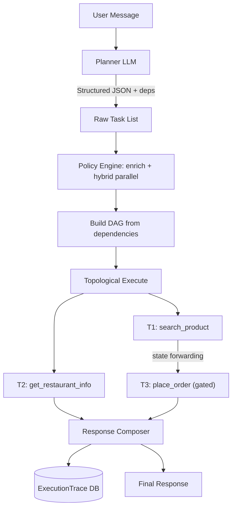
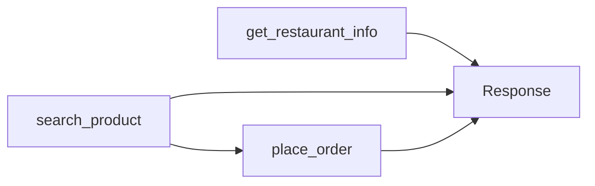
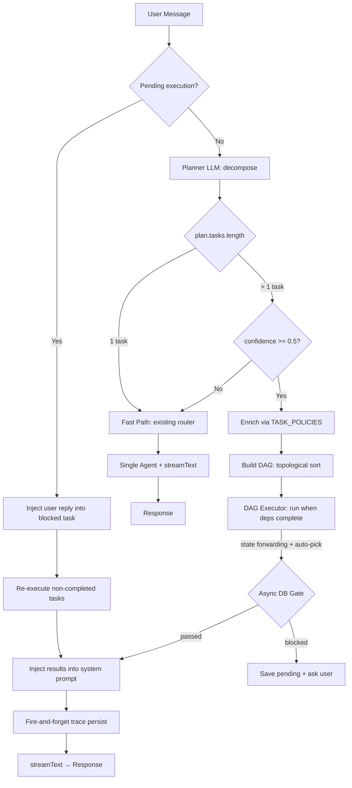

# Multi-Intent Orchestration — How It Works in the QR Order AI Assistant

## Overview

Multi-Intent Orchestration is a **task decomposition + policy-driven execution layer** that handles user messages containing multiple distinct intents. Instead of routing to a single agent, the system follows a 5-component pipeline:

```
V1: User Message → Planner LLM → Raw Tasks → Policy Engine (enrich + plan) → Staged Executor → Response Composer
V2: User Message → Planner LLM → Raw Tasks → Policy Engine (enrich + hybrid parallel) → DAG Executor (state forwarding) → Response Composer + Trace Persist
V3: User Message → Resume Check → Planner LLM → Confidence Gate → Policy Engine (config-driven) → DAG Executor (retry + auto-pick) → Response Composer + Trace Persist
```

Goals: handle **complex multi-part requests**, ensure **safe mutation execution** (no wrong SKU, no duplicate orders), and maintain **zero latency regression** for the 90%+ of messages that are single-intent.

---

## Why Multi-Intent Matters for This Project

### Current Problem

The original AI Router picks ONE intent per message:

```
"Tìm sữa hạt rồi thêm 2 lọ dầu dừa vào giỏ" → Router picks SEARCH or ORDER → other intent is lost
```

This causes:

- **Incomplete responses** — user gets only half of what they asked
- **User must repeat themselves** — poor UX for natural multi-part requests
- **Hard-coded intent routing** doesn't reflect how people naturally speak

### Solution

Build a **5-component pipeline** that decomposes, validates, and executes tasks safely:



---

## The 5-Component Architecture

### Component 1 — Planner (LLM)

**File:** `ai-router.service.ts` → `planTasks()`

The Planner decomposes user messages into atomic tasks. It uses `generateObject` with a Zod schema to guarantee structured JSON output — **no chain-of-thought reasoning, no free-form text**.

```typescript
const TaskPlanSchema = z.object({
  tasks: z.array(z.object({
    id: z.string(),         // "t1", "t2"
    intent: z.enum([...]),  // 'search_product', 'place_order', etc.
    params: z.record(z.unknown())
  })).min(1).max(4),
  isMultiIntent: z.boolean(),
  confidence: z.number().min(0).max(1),
  suggestedDependencies: z.array(...).optional()  // V2: used for DAG
})
```

**Key rules in the prompt:**

1. Most messages have **ONE intent** — only split when user asks for multiple _different_ things
2. `"tìm sữa hạt và dầu dừa"` = **ONE** `search_product` task (multi-entity, not multi-intent)
3. `"tìm sữa hạt rồi thêm dầu dừa vào giỏ"` = **TWO** tasks (`search` + `place_order`)
4. Max 4 tasks per message

**Fast path:** If planner returns 1 task → skip orchestration entirely, route to existing single-agent flow with zero overhead.

**Confidence threshold (0.5):** Low confidence + `isMultiIntent` → show decomposition preview to user for confirmation instead of executing (uncertainty → reduce automation). Handled entirely in `ai-chat.service.ts`.

### Component 2 — Policy Engine (Pure Code)

**File:** `task-policy.ts`

The Policy Engine enriches LLM output with domain metadata and builds the execution plan. **This is 100% deterministic code — no LLM involved.**

#### A. Intent Registry

```typescript
// Lazy-loaded via getTaskPolicies() — merges code defaults with config/task-policies.json
getTaskPolicies() → {
  search_product:       { actionType: 'read',  resource: 'catalog',  requiresConfirmation: false },
  search_faq:           { actionType: 'read',  resource: 'faq',      requiresConfirmation: false },
  get_restaurant_info:  { actionType: 'read',  resource: 'settings', requiresConfirmation: false },
  get_order_status:     { actionType: 'read',  resource: 'order',    requiresConfirmation: false },
  get_available_coupons:{ actionType: 'read',  resource: 'coupon',   requiresConfirmation: false },
  place_order:          { actionType: 'write', resource: 'order',    requiresConfirmation: true  },
  cancel_order:         { actionType: 'write', resource: 'order',    requiresConfirmation: true  },
  apply_coupon:         { actionType: 'write', resource: 'coupon',   requiresConfirmation: false },
  general_chat:         { actionType: 'read',  resource: 'general',  requiresConfirmation: false },
}
```

**Why not let LLM decide `actionType`/`resource`?**

- LLM can hallucinate — may classify `place_order` as `read`
- Code is **deterministic, testable, auditable**
- Policy changes don't require prompt engineering

#### B. Execution Plan — Hybrid Parallel (V2)

```typescript
// V1 whitelist: O(1) fast-path for battle-tested pairs
const PARALLEL_SAFE_PAIRS = [
  ['search_product', 'search_faq'],
  ['search_product', 'get_restaurant_info'],
  // ... 7 pairs total
]

// V2 hybrid: whitelist fast-path + resource-based auto-detect
function shouldRunParallel(a: EnrichedTask, b: EnrichedTask): boolean {
  // O(1) fast-path: whitelist
  if (isPairSafeForParallel(a.intent, b.intent)) return true
  // Fallback: auto-detect for new intents
  if (a.actionType === 'read' && b.actionType === 'read' && a.resource !== b.resource) return true
  return false
}
```

**Execution rules:**

| Condition                                  | Strategy                          |
| ------------------------------------------ | --------------------------------- |
| read + read (whitelisted pair)             | **Parallel** — V1 fast-path       |
| read + read (different resource, unlisted) | **Parallel** — V2 auto-detect     |
| read + read (same resource)                | Sequential                        |
| write + write                              | Sequential only                   |
| transaction                                | Always sequential                 |
| Task B depends on Task A                   | Sequential (DAG enforced)         |
| Unresolved entity → mutation               | **Blocked** (disambiguation gate) |

### Component 3 — Disambiguation Gate

**File:** `task-policy.ts` → `canExecuteMutationV2()`

Before any `write` or `transaction` task executes, the gate checks:

| Version | Check                          | How                   |
| ------- | ------------------------------ | --------------------- |
| V1      | Ambiguous dish name (≤2 chars) | Sync heuristic        |
| **V2**  | Actual DB match count          | `prisma.dish.count()` |

```typescript
// V2: async DB-based
async function canExecuteMutationV2(task, resolvedParams): Promise<GateResult> {
  // ... confirmation check ...
  if (task.intent === 'place_order') {
    for (const item of items) {
      const count = await prisma.dish.count({
        where: { name: { contains: item.dishName.toLowerCase() }, status: 'Available' },
      })
      if (count === 0) return { blocked: true, reason: 'missing_params' }
      if (count > 1) return { blocked: true, reason: 'multiple_candidates' }
    }
  }
}
```

Falls back to V1 heuristic if DB query fails (graceful degradation).

### Component 4 — DAG Executor (V2)

**File:** `task-executor.ts` → `executeTasksV2()`

V1 used flat stages (stage 1, stage 2...). **V2 uses a DAG (Directed Acyclic Graph):**



**How it works:**

1. `buildDAG()` — builds adjacency from `suggestedDependencies` + implicit deps (reads before same-resource writes)
2. `hasCycle()` — DFS cycle detection → fallback to sequential
3. **Topological execute:** tasks run as soon as their dependencies complete, not waiting for whole stage
4. `groupByParallelSafety()` — groups ready tasks using hybrid parallel check
5. `Promise.allSettled` for parallel groups

**Key difference from V1:** Tasks run when deps complete, not waiting for entire stage.

#### State Forwarding (V2)

Prior read results are injected into dependent write tasks:

```typescript
function injectDependencyResults(task, deps, stateCtx): EnrichedTask {
  // Attach __priorResults to task.params for dependent tasks
  return { ...task, params: { ...task.params, __priorResults: priorResults } }
}
```

**Policy:** V2: present-and-ask (show results, ask user). V3: auto-pick if exactly 1 match (see §8 below).

#### Idempotency

Prevents duplicate mutations from retry or double-send:

```typescript
// Key = hash(sessionId + messageTimestamp + taskId)
// TTL = 30 seconds
// If duplicate → return cached result with status 'deduplicated'
```

### Component 5 — Response Composer

**File:** `ai-chat.service.ts` (inline)

Combines execution results into a single coherent streamed response:

- **Method:** `streamText` (preserves same streaming UX as single-intent)
- **Completed tasks:** Results injected into system prompt as structured context
- **Blocked tasks:** Appended as follow-up questions ("Có 3 loại dầu dừa — bạn muốn loại nào?")
- **Failed tasks:** Mentioned with graceful error message
- **Partial success:** Always returns completed results even if some tasks block/fail

---

## V3 Enhancements

### 6. Multi-Turn Resume (G1)

**File:** `pending-execution.ts` + `ai-chat.service.ts`

**Problem:** In V2, when a task is blocked (needs user confirmation), the system asks the user but doesn't remember the DAG state. When the user replies, the system re-plans from scratch — losing all previously completed results.

**Solution:** Save DAG state when blocked, check for pending execution before re-planning:

```typescript
// BEFORE planner runs:
const pending = getPendingExecution(session)
if (pending) {
  // Inject user reply as __userReply param on blocked task
  // Re-execute only non-completed tasks from saved DAG
  // Clear pending after successful resume
  // Assign all tools (search + order + FAQ) for follow-up actions
}
if (!isResumed) {
  const plan = await planTasks(recentMessages) // Normal flow
}
```

**Why it matters:** When the user says "find coconut oil and add to cart" → search completes, place_order blocked (3 variants found) → system asks which one → user picks "500ml bottle" → resume place_order with cached search results, no redundant re-search.

### 7. Retry with Backoff

**File:** `task-executor.ts` → `executeWithRetry()`

**Problem:** Tool calls can fail due to transient network/timeout issues, but V2 immediately marks them as failed.

**Solution:** Wrap executor calls with retry (1 attempt, 500ms delay), only retries transient errors:

```typescript
async function executeWithRetry<T>(fn: () => Promise<T>, maxRetries = 1, delayMs = 500): Promise<T>
```

### 8. Auto-Pick Results (State Forwarding Enhancement)

**File:** `task-executor.ts` → `injectDependencyResults()`

**Problem:** V2 always present-and-ask when prior results exist → adds an extra turn for user selection, even when the result is unambiguous.

**Solution:** When prior results contain exactly 1 match → auto-inject into params, bypass disambiguation gate:

```typescript
// If exactly 1 result from dependency → auto-pick, skip disambiguation
if (priorResults.length === 1) {
  task.params.__autoPickedResult = priorResults[0]
}
```

### 9. Confidence Gate

**File:** `ai-chat.service.ts` → `LOW_CONFIDENCE = 0.5`

**Problem:** The LLM planner can decompose incorrectly → executing wrong tasks leads to poor UX.

**Solution:** When `confidence < 0.5` + `isMultiIntent = true` → don't execute multi-intent pipeline. Instead, show the decomposition preview to the user for confirmation:

```typescript
if (plan.isMultiIntent && plan.confidence < LOW_CONFIDENCE) {
  // Show preview: "Mình hiểu bạn muốn: ... Đúng không?"
  // This avoids executing tasks the planner is unsure about
}
```

> **Note:** Confidence gating is handled solely in `ai-chat.service.ts` (single threshold of 0.5). The router returns the full plan without filtering.

### 10. Policy-as-Config (JSON) — _Partially Implemented_

**File:** `task-policy.ts` → loads `server/config/task-policies.json` at first usage

**Problem:** Changing policies (adding new intents, switching read→write) requires code changes + redeployment.

**Current state:** `getTaskPolicies()` lazily loads and merges JSON config over code defaults. Create the JSON file to override:

```json
{
  "search_product": { "actionType": "read", "resource": "catalog", "requiresConfirmation": false },
  "place_order": { "actionType": "write", "resource": "order", "requiresConfirmation": true }
}
```

**Why it matters:** Ops team can change policies without developer deployment. Example: temporarily set `apply_coupon` to `requiresConfirmation: true` during a promotion campaign.

### 11. Trace Analytics & Learning

**File:** `trace-analytics.ts` → `getTraceAnalytics()`

**Problem:** V2 persists traces but doesn't analyze them — no visibility into where users commonly get blocked.

**Solution:** Query function on trace data:

- `getTraceAnalytics(days)` — aggregates over a time window: total executions, avg latency, success/block/fail rates, top blocked intents
- Future: `getRecentBlockPatterns()` — will detect patterns like "80% of place_order blocked due to multiple_candidates" → signal to improve search ranking

---

## Execution Trace Persistence (V2)

Every multi-intent execution is persisted to DB for analytics:

```
ExecutionTrace table: sessionId, taskCount, completedCount, blockedCount, failedCount, totalLatencyMs, traceData (JSON)
```

- **Persist:** Fire-and-forget (non-blocking — never delays response)
- **Cleanup:** Weekly cron job (Monday 3:00 AM) deletes traces older than 30 days
- **File:** `jobs/cleanupExecutionTrace.job.ts`

---

## Flow: Single vs Multi Intent (V3)



---

## Examples

### Example 1: Multi-Intent Read+Read (Parallel)

**Input:** `"tìm sữa hạt và cho biết giờ mở cửa"`

```
Planner → [
  { id: "t1", intent: "search_product", params: { query: "sữa hạt" } },
  { id: "t2", intent: "get_restaurant_info", params: {} }
]

DAG: t1 → (no deps), t2 → (no deps)
shouldRunParallel(t1, t2) → true (whitelisted pair)

Executor → Promise.allSettled([searchMenu, getRestaurantInfo])

Composer → "Kết quả tìm sữa hạt: [results]... Giờ mở cửa: 10:00 - 22:00"
```

### Example 2: Multi-Intent Read→Write (State Forwarding)

**Input:** `"tìm dầu dừa rẻ nhất rồi thêm vào giỏ"`

```
Planner → [
  { id: "t1", intent: "search_product", params: { query: "dầu dừa" } },
  { id: "t2", intent: "place_order", params: { items: [{ dishName: "dầu dừa", qty: 1 }] } }
]
suggestedDependencies: [{ from: "t1", to: "t2" }]

DAG: t1 → t2 (explicit dep + implicit: same resource 'order' writes after reads)

Executor →
  Step 1: searchMenu("dầu dừa") → results → stateCtx.set("t1", results)
  Step 2: injectDependencyResults(t2, deps, stateCtx) → t2.params.__priorResults = [...]
          canExecuteMutationV2(t2) → prisma.dish.count("dầu dừa") → 3 matches → blocked

Composer → "Tìm thấy 3 loại dầu dừa: [...]. Bạn muốn thêm loại nào?"
```

### Example 3: Single Intent (Fast Path)

**Input:** `"tìm pizza"`

```
Planner → [{ id: "t1", intent: "search_product", params: { query: "pizza" } }]

isSingleIntent = true → Fast Path → existing SEARCH agent → zero overhead
```

### Example 4: Multi-Entity, Single Intent (NOT multi-intent)

**Input:** `"tìm sữa hạt và dầu dừa"`

```
Planner → [{ id: "t1", intent: "search_product", params: { query: "sữa hạt và dầu dừa" } }]

isSingleIntent = true → Fast Path → single search returns both items
```

### Example 5: Multi-Turn Resume (V3)

**Turn 1 Input:** `"tìm dầu dừa rồi thêm vào giỏ"`

```
Planner → [
  { id: "t1", intent: "search_product", params: { query: "dầu dừa" } },
  { id: "t2", intent: "place_order", params: { items: [{ dishName: "dầu dừa", qty: 1 }] } }
]

Executor →
  t1: search → 3 results → stateCtx.set("t1", results)
  t2: canExecuteMutationV2 → 3 matches → BLOCKED (multiple_candidates)

savePendingExecution(session, { dag, stateCtx, blockedTaskId: "t2", completedTaskIds: ["t1"] })

Composer → "Tìm thấy 3 loại dầu dừa: [A, B, C]. Bạn muốn thêm loại nào?"
```

**Turn 2 Input:** `"loại B"`

```
getPendingExecution(session) → found! blockedTaskId = "t2"
Inject __userReply = "loại B" into t2.params
Skip planner — resume DAG directly

Executor →
  t1: already completed → skip
  t2: re-run with __userReply = "loại B" → canExecuteMutationV2 → passed → execute

clearPendingExecution(session)

Composer → "Đã thêm Dầu dừa B vào giỏ hàng!"
```

---

## Design Principles

| #   | Principle                           | V1 → V2 → V3                                          |
| --- | ----------------------------------- | ----------------------------------------------------- |
| 1   | **LLM parses, code decides**        | Unchanged                                             |
| 2   | **Structured JSON, not CoT**        | Unchanged                                             |
| 3   | **Default sequential**              | V2: DAG. V3: DAG + retry                              |
| 4   | **No mutation without target**      | V2: async DB gate. V3: auto-pick when exactly 1 match |
| 5   | **Idempotency for mutations**       | Unchanged                                             |
| 6   | **Partial success**                 | V2: state forwarding. V3: + multi-turn resume         |
| 7   | **Fast path for single intent**     | Unchanged                                             |
| 8   | **Uncertainty → reduce automation** | V2: present-and-ask. V3: confidence gate              |
| 9   | **Graceful degradation**            | V2: fallback heuristic. V3: + retry transient errors  |
| 10  | **Observability**                   | V2: traces. V3: + analytics queries + block patterns  |
| 11  | **Ops-friendly**                    | V3: policy-as-config (JSON, no redeploy)              |

---

## Roadmap

| Phase  | Scope                                                                                                   | Status      |
| ------ | ------------------------------------------------------------------------------------------------------- | ----------- |
| **V1** | Task decomposition + whitelist parallel + disambiguation gate + idempotency + logging                   | ✅ Complete |
| **V2** | Hybrid parallel + DAG executor + state forwarding + async DB gate + trace persistence                   | ✅ Complete |
| **V3** | Multi-turn resume + retry + auto-pick + confidence gate + trace analytics _(policy-as-config: planned)_ | ✅ Complete |

---

## File Structure

```
server/src/
├── services/
│   ├── ai-router.service.ts    # Planner: planTasks() → structured task list + confidence + suggestedDependencies
│   ├── task-policy.ts          # Policy Engine: enrichTasks(), shouldRunParallel(), canExecuteMutationV2()
│   ├── task-executor.ts        # DAG Executor: buildDAG(), executeTasksV2(), executeWithRetry(), auto-pick, persistTrace()
│   ├── trace-analytics.ts      # V3: getTraceAnalytics() — query aggregated execution data
│   ├── pending-execution.ts    # V3: Multi-turn resume store (in-memory Map, TTL 5min)
│   ├── ai-chat.service.ts      # Integration: resume check → planner → confidence gate → pipeline → response composition
│   └── agents/
│       ├── search.agent.ts     # Search tools (menu, semantic, categories, popular)
│       ├── order.agent.ts      # Order tools (place, cancel, status, coupons)
│       └── faq.agent.ts        # FAQ tools (restaurant info, FAQ search)
├── jobs/
│   └── cleanupExecutionTrace.job.ts  # Weekly cron: delete traces > 30 days
└── prisma/
    └── schema.prisma           # ExecutionTrace model
```

---

## References

- **Requirements:** [`docs/ai/requirements/feature-multi-intent-orchestration.md`](docs/ai/requirements/feature-multi-intent-orchestration.md)
- **Design:** [`docs/ai/design/feature-multi-intent-orchestration.md`](docs/ai/design/feature-multi-intent-orchestration.md)
- **Planning:** [`docs/ai/planning/feature-multi-intent-orchestration.md`](docs/ai/planning/feature-multi-intent-orchestration.md)
