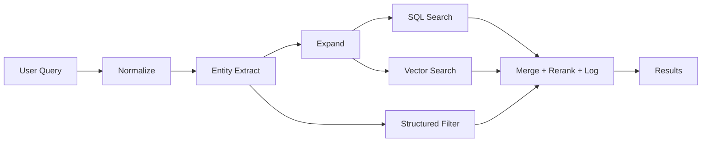

# Query Expansion — How It's Applied in the QR Order AI Assistant

## Overview

Query Expansion is a **retrieval pre-processing layer** sitting between the user query and the search/retrieval system. Instead of throwing a raw query directly into a vector database, the system follows a 5-layer pipeline:

```
User query → Normalize → Entity Extract → Expand → Retrieve → Rerank + Log
```

Goals: increase **recall** (find more relevant results), **semantic coverage** (cover multiple phrasings), and **multilingual matching** (VI/EN/RU) — while maintaining **precision** (no junk results).

---

## Why Query Expansion Matters for This Project

### Current Problem

The AI Assistant's `searchMenuSemantic` throws the raw query directly into ChromaDB:

```
"sữa hạt" → embedding → ChromaDB vector distance → top 5
```

This causes:

- **"Big Boy Burger"** may return "Veggie Wrap" because it's closer in embedding space
- **"sữa hạt"** never matches "Sữa Hạt Macca 500ml" because the system doesn't know they're related
- **" sua hat "** (typo, missing diacritics) goes straight into search, returns garbage
- SQL fallback only runs when ChromaDB **completely fails** — low-quality results still pass through

### Solution

Build a **5-layer pipeline** with Hybrid RAG:



---

## The 5-Layer Architecture

### Layer 1 — Query Normalization

Standardize the query before any processing:

| Operation       | Input                   | Output           |
| --------------- | ----------------------- | ---------------- |
| Trim            | `"  sữa hạt  "`         | `"sữa hạt"`      |
| Lowercase       | `"Sữa Hạt"`             | `"sữa hạt"`      |
| Unicode NFC     | `"su\u0301a ha\u0323t"` | `"sữa hạt"`      |
| Language detect | `"sữa hạt"`             | `{ lang: "vi" }` |

### Layer 2 — Entity Extraction

Extracts structured entities from the query **and** derives analysis flags. This replaces the need for a separate "Query Analysis" step — entity extraction subsumes analysis.

```typescript
interface ExtractedQuery {
  // Entities (matched against Dish model fields)
  category?: string // "mì", "khai vị" → DishCategory.name
  ingredient?: string // "bò", "gà" → Dish.ingredients
  taste?: string // "cay", "ngọt" → Dish.tags
  allergenExclusion?: string // "đậu phộng" → Dish.allergens NOT contains

  // Analysis flags (derived from entities)
  isShort: boolean // ≤ 3 words → expand more aggressively
  hasCatalogCategory: boolean // = (category !== undefined)
  shouldUseSynonyms: boolean // always true for V1
  shouldUseCatalog: boolean // = (category !== undefined)
  shouldUseFilter: boolean // = at least 1 entity was extracted
}
```

Example: `"mì cay bò không đậu phộng"` →

```json
{
  "category": "mì",
  "taste": "cay",
  "ingredient": "bò",
  "allergenExclusion": "đậu phộng",
  "shouldUseFilter": true,
  "shouldUseCatalog": true
}
```

V1 implementation: **rule-based** — match query tokens against known category names (from DB) + static dictionaries for taste/ingredient/allergen keywords.

### Layer 3 — Query Expansion Engine

Each expansion carries a **weight** to prevent overshadowing the original intent:

| Source                          | Weight | Example                             |
| ------------------------------- | ------ | ----------------------------------- |
| **Original**                    | `1.0`  | `"sữa hạt"`                         |
| **Synonym** (static dictionary) | `0.8`  | `"nut milk"`, `"plant-based milk"`  |
| **Catalog** (queries real DB)   | `0.7`  | `"Sữa Hạt Macca"`, `"Sữa Hạt Điều"` |

#### A. Dictionary / Synonym Expansion

A static, domain-specific dictionary for the restaurant menu:

```json
{
  "sữa hạt": ["nut milk", "plant-based milk"],
  "gà": ["chicken", "gà rán", "gà nướng"],
  "cay": ["spicy", "hot"],
  "chay": ["vegetarian", "vegan", "plant-based"],
  "khai vị": ["appetizer", "starter"]
}
```

Advantages: cheap, fast, easy to control, extremely effective for narrow domains.

#### B. Catalog-Aware Expansion

Expands based on **real data in the database**. When a user types "sữa hạt", the system queries Prisma for dishes with matching categories/tags and returns actual dish names.

More accurate than LLM guessing because it's based on **real data**.

#### Limits

- Max **8 expansions** per query (prevents search dilution)
- Deduplicate before searching
- Original query always has the highest weight (1.0)

### Layer 4 — 3-Way Hybrid Retrieval

Run **3 search sources concurrently** via `Promise.allSettled`:

| Source                               | Input                    | Best for                                        |
| ------------------------------------ | ------------------------ | ----------------------------------------------- |
| **SQL Keyword** (Prisma LIKE)        | Expanded terms           | Exact names, categories, tags                   |
| **Vector Search** (ChromaDB)         | Original query embedding | Descriptive queries, multilingual, semantic     |
| **Structured Filter** (Prisma WHERE) | Extracted entities       | Category, ingredient, taste, allergen exclusion |

`Promise.allSettled` (not `Promise.all`): if one source fails, the others still return results → **graceful degradation**.

### Layer 5 — Merge + Dedup + Rerank + Log

Combine results, deduplicate by `dish.id`, and score:

| Match Type                  | Score                                |
| --------------------------- | ------------------------------------ |
| SQL exact name match        | `100 × expansion.weight`             |
| Structured filter match     | `80` (entity-based, high confidence) |
| SQL category/tag match      | `70 × expansion.weight`              |
| Vector match                | `(1 - distance) × 60`                |
| Appears in multiple sources | Additive bonus (`+score × 0.5`)      |

Sort descending → exact keyword matches **always** rank above fuzzy semantic matches.

**Structured logging** captures the complete pipeline:

```json
{
  "query_original": "mì cay bò",
  "query_normalized": "mì cay bò",
  "entities": { "category": "mì", "taste": "cay", "ingredient": "bò" },
  "expansions": [
    { "text": "mì cay bò", "source": "original", "weight": 1.0 },
    { "text": "spicy noodles", "source": "synonym", "weight": 0.8 }
  ],
  "retrieval_mode": "hybrid",
  "sql_count": 3,
  "vector_count": 5,
  "filter_count": 2,
  "final_count": 6,
  "top_result": "Mì Cay Bò Tokbokki",
  "latency_ms": 84
}
```

---

## Application Guidelines

### ✅ Expand aggressively when

- Query is very short (1-3 words)
- Many synonyms exist (sữa hạt, gà, bò...)
- Multilingual input
- Search recall is currently low

### ⚠️ Expand lightly when

- Query is already very specific ("Big Boy Burger Combo")
- Contains exact IDs or codes
- Exact-match is more important than recall

### ❌ Common mistakes to avoid

1. **Using LLM for every query** — expensive, slow, unstable
2. **Expanding too broadly** — recall increases but precision drops
3. **No reranker** — expansion without reranking produces noisy results
4. **Not logging expansion sources** — impossible to debug later
5. **Treating all expansions equally** — must use weights to preserve original intent

---

## FAQ Search Pipeline (Lightweight Hybrid)

FAQ search uses a **simpler 4-layer pipeline** — no entity extraction, no structured filter, lighter expansion.

```
FAQ: Query → Normalize → Expand (light) → [SQL + Vector] → Simple Rerank → Log
Menu: Query → Normalize → Entity Extract → Expand → [SQL + Vector + Filter] → Rerank → Log
```

### Menu vs FAQ — Side-by-Side

|                       | **Menu Search**                                              | **FAQ Search**                      |
| --------------------- | ------------------------------------------------------------ | ----------------------------------- |
| **Pipeline**          | 5-layer (full)                                               | 4-layer (lightweight)               |
| **DB Model**          | `Dish` (name, price, category, tags, ingredients, allergens) | `FAQ` (question, answer, category)  |
| **Data size**         | Hundreds of dishes                                           | Tens of FAQs                        |
| **Normalize**         | ✅ Full                                                      | ✅ Full (same)                      |
| **Entity Extraction** | ✅ category, ingredient, taste, allergen                     | ❌ Not needed                       |
| **Synonym Expansion** | ✅ Always (weight 0.8)                                       | ⚡ Only if query ≤ 3 words          |
| **Catalog Expansion** | ✅ Query DB for dish names (weight 0.7)                      | ❌ Not needed                       |
| **Retrieval**         | 3-way: SQL + Vector + Structured Filter                      | 2-way: SQL + Vector                 |
| **Structured Filter** | ✅ Entities → WHERE clause                                   | ❌ Only `isActive: true`            |
| **Rerank**            | ✅ Weighted scoring (100/80/70/60×)                          | ⚡ Simple heuristic                 |
| **Log**               | ✅ Full (entities, expansions, latency)                      | ✅ Simpler (query, counts, latency) |

### Why different?

- **Menu** needs heavy pipeline: short queries, many synonyms, attribute filtering (category/allergen/ingredient), large dataset
- **FAQ** only needs lightweight: natural question queries, small dataset, questions match well with semantic search, no attribute complexity

### Example

**Menu: `"mì cay bò"` →**

```
Entity: { category: "mì", taste: "cay", ingredient: "bò" }
Expand: ["mì cay bò", "spicy beef noodles"]
3-way: SQL + Vector + Filter(category=mì, tags=cay, ingredients=bò)
→ Rerank → "Mì Cay Bò Tokbokki" (#1)
```

**FAQ: `"giờ mở cửa?"` →**

```
Normalize: "giờ mở cửa?"
Expand light: ["giờ mở cửa", "opening hours"]
2-way: SQL(question LIKE) + Vector
→ Simple rerank → "Nhà hàng mở cửa từ 10:00 - 22:00" (#1)
```

---

## Roadmap

| Phase            | Scope       | Description                                                                                         |
| ---------------- | ----------- | --------------------------------------------------------------------------------------------------- |
| **V1** (current) | Menu search | Normalize + entity extract + synonym + catalog + 3-way hybrid retrieval + rerank + logging          |
| **V1**           | FAQ search  | Normalize + light expansion + keyword + vector + simple rerank (lightweight)                        |
| **V2**           | Upgrades    | Typo correction, multilingual expansion, embedding-neighbor expansion, selective DB log persistence |
| **V3**           | Advanced    | LLM expansion (fallback), learning from search logs, caching, analytics                             |

### Architecture Decisions

| Decision                                       | Rationale                                                     |
| ---------------------------------------------- | ------------------------------------------------------------- |
| Entity extraction subsumes query analysis      | One layer does both — entities provide all flags needed       |
| 3-way hybrid retrieval (SQL + Vector + Filter) | Entities enable structured filtering as a third search source |
| Rule-based first, LLM as fallback (V3)         | Cheap, fast, deterministic, debuggable                        |
| Static synonym dictionary (JSON)               | Easy to maintain, domain-specific, no API cost                |
| Catalog expansion from real DB                 | More accurate than LLM guessing                               |
| Weighted expansions                            | Prevents expansion from overshadowing original intent         |
| `Promise.allSettled`                           | Graceful degradation                                          |
| Pino structured logs (V1), DB persist (V2)     | Ship fast, schema ready for future persistence                |

---

## File Structure

```
server/src/
├── data/
│   ├── synonyms.json              # Static synonym dictionary
│   └── entity-dictionaries.ts     # Taste, ingredient, allergen arrays
├── services/
│   ├── hybrid-rag.service.ts      # 5-layer pipeline
│   ├── agents/
│   │   └── search.agent.ts        # searchMenuSemantic calls hybridRagService
│   ├── chroma.service.ts          # Vector store (unchanged)
│   └── embedding.service.ts       # Embedding API (unchanged)
```

---

## References

- **Full requirements:** [`docs/ai/requirements/feature-hybrid-rag.md`](docs/ai/requirements/feature-hybrid-rag.md)
- **Detailed design:** [`docs/ai/design/feature-hybrid-rag.md`](docs/ai/design/feature-hybrid-rag.md)
- **Task planning:** [`docs/ai/planning/feature-hybrid-rag.md`](docs/ai/planning/feature-hybrid-rag.md)
