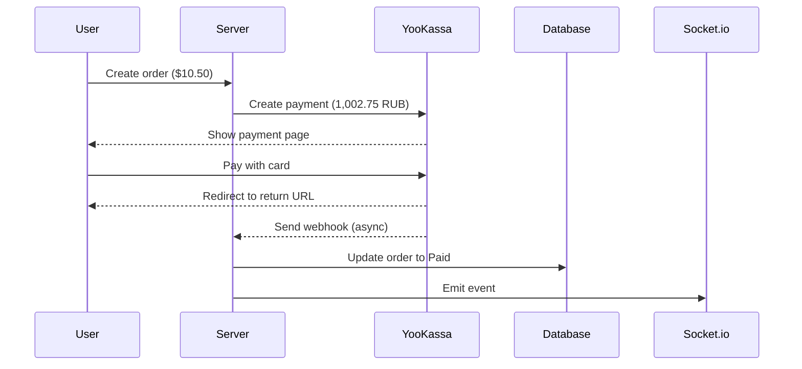

# YooKassa Quick Start - 5 Minutes Setup

## 🚀 Fast Track to Get YooKassa Running

### Step 1: Install Dependencies (Already Done ✅)
```bash
cd server
npm install @appigram/yookassa-node
```

### Step 2: Add Environment Variables
Add to `server/.env`:
```bash
# YooKassa Configuration
YOOKASSA_SHOP_ID=your_shop_id_here
YOOKASSA_SECRET_KEY=your_secret_key_here
YOOKASSA_RETURN_URL=http://localhost:4000/api/payments/yookassa/return
```

### Step 3: Get Credentials from YooKassa
1. Sign up at https://yookassa.ru/
2. Go to Settings → API Settings
3. Copy Shop ID and Secret Key
4. Enable Test Mode for development

### Step 4: Test the Integration
```bash
# Start server
cd server
npm run dev

# In your app:
# 1. Create order
# 2. Select YooKassa payment
# 3. Use test card: 5555 5555 5555 4444
# 4. Complete payment
# 5. You'll be redirected back ✅
```

### Step 5: Configure Webhook (For Production)
When deploying to production:
1. Go to YooKassa Dashboard → Settings → HTTP Notifications
2. Add webhook URL: `https://your-domain.com/api/payments/yookassa/webhook`
3. Select events: `payment.succeeded`, `payment.canceled`, `payment.waiting_for_capture`

---

## 🧪 Test Cards

| Card Number | Result |
|-------------|--------|
| 5555 5555 5555 4444 | ✅ Success |
| 5555 5555 5555 5599 | ❌ Failed |
| 5555 5555 5555 4477 | 🔐 3D Secure |

---

## 📊 What Happens During Payment

```
User Order: $10.50 USD
    ↓
System converts: 10.50 × 95.5 = 1,002.75 RUB
    ↓
User pays: 1,002.75 RUB on YooKassa
    ↓
System saves: $10.50 USD in database
    ↓
Order status: Paid ✅
```

---

## 🔄 Payment Flow



---

## 📁 Files Added/Modified

### New Files ✨
- `server/src/utils/yookassa.ts` - YooKassa API wrapper
- `server/src/types/yookassa.d.ts` - TypeScript types
- `docs/YOOKASSA_SETUP_GUIDE.md` - Complete guide
- `docs/YOOKASSA_ENV_VARS.md` - Environment variables
- `docs/ai/implementation/yookassa-integration-summary.md` - Implementation summary

### Modified Files 📝
- `server/src/config.ts` - Added YooKassa env vars
- `server/src/utils/currency.ts` - Added USD→RUB conversion
- `server/src/constants/type.ts` - Added YooKassa payment method
- `server/src/controllers/payment.controller.ts` - Added YooKassa handlers
- `server/src/routes/payment.route.ts` - Added YooKassa routes
- `server/package.json` - Added @appigram/yookassa-node

---

## ✅ Quick Verification Checklist

After setup, verify:
- [ ] Server starts without errors
- [ ] YooKassa appears as payment option
- [ ] Can create payment and get redirected
- [ ] Payment URL opens YooKassa page
- [ ] Can complete test payment
- [ ] Redirected back to app after payment
- [ ] Order status updates to "Paid"

---

## 🐛 Troubleshooting

### Server won't start?
- Check all environment variables are set
- Run `npm install` again

### Webhook not working?
- For local dev, use ngrok: `ngrok http 4000`
- Configure webhook URL in YooKassa dashboard
- Check webhook logs in YooKassa dashboard

### Currency conversion fails?
- System uses fallback rate (95 RUB/USD)
- Check internet connection for live rates

---

## 📚 Full Documentation

For detailed information, see:
- **Complete Setup Guide**: `docs/YOOKASSA_SETUP_GUIDE.md` (350+ lines)
- **Implementation Summary**: `docs/ai/implementation/yookassa-integration-summary.md`

---

## 💡 Key Points

1. **Currency**: YooKassa only accepts RUB (Russian Ruble)
2. **Conversion**: Automatic USD → RUB at live exchange rates
3. **Storage**: Orders stored in USD, converted for payment only
4. **Webhook**: Real source of truth for payment status
5. **Return URL**: For showing result to user (not reliable for business logic)

---

## 🎯 Production Deployment

When ready for production:
1. Get production credentials from YooKassa
2. Update `.env` with production values
3. Configure production webhook URL (must be HTTPS)
4. Complete business verification with YooKassa
5. Switch from test mode to live mode

---

**Ready to go!** 🚀

For questions, check the full setup guide or YooKassa documentation.
