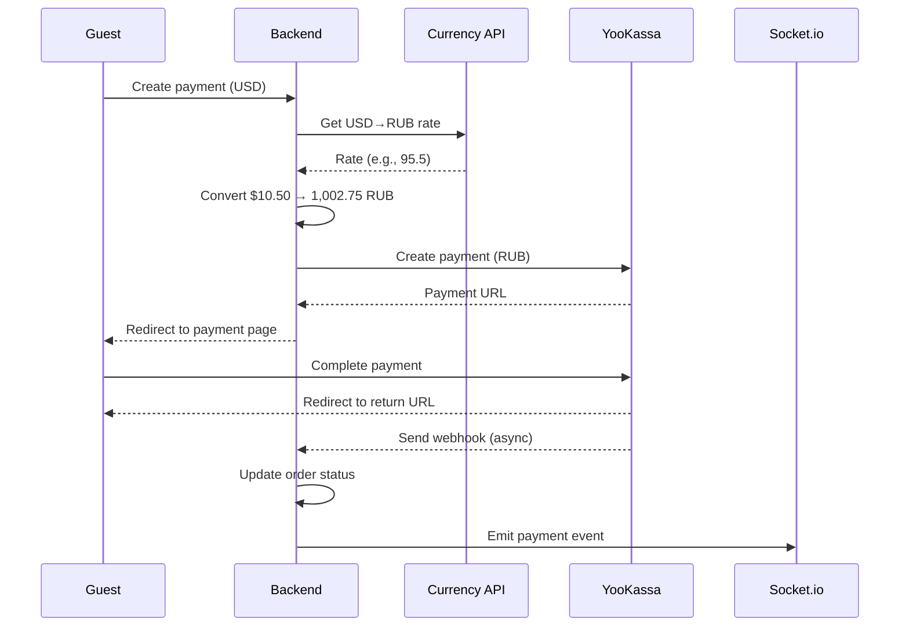

# YooKassa Payment Integration Guide

## 📋 Overview

This guide explains how to integrate **YooKassa** (Russian payment gateway) into your QR Code Order system. YooKassa is similar to VNPay and Stripe but specifically for the Russian market.

### Key Features
- ✅ Accepts payments in **RUB (Russian Ruble)** only
- ✅ Automatic currency conversion from USD → RUB
- ✅ Support for various Russian payment methods (cards, Yandex.Money, QIWI, etc.)
- ✅ Webhook notifications for real-time payment updates
- ✅ Test mode for development

---

## 🔧 1. Setup YooKassa Account

### Step 1: Register for YooKassa
1. Go to [YooKassa website](https://yookassa.ru/)
2. Click **"Подключить"** (Connect) or **"Регистрация"** (Register)
3. Complete the registration process
4. You'll need a Russian entity or IP (Individual Entrepreneur) to use in production

### Step 2: Get API Credentials
1. Log in to [YooKassa Dashboard](https://yookassa.ru/my)
2. Go to **Settings** → **API Settings**
3. You'll find:
   - **Shop ID** (shopId)
   - **Secret Key** (secretKey)

### Step 3: Enable Test Mode
1. In the YooKassa dashboard, enable **Test mode**
2. Get test credentials for development

---

## 🔑 2. Environment Configuration

Add these variables to your `.env` file in the `server` directory:

```bash
# YooKassa Configuration
YOOKASSA_SHOP_ID=your_shop_id_here
YOOKASSA_SECRET_KEY=your_secret_key_here
YOOKASSA_RETURN_URL=http://localhost:4000/api/payments/yookassa/return

# For production
# YOOKASSA_RETURN_URL=https://your-domain.com/api/payments/yookassa/return
```

### 🧪 Test Credentials (for development)
YooKassa provides test credentials in test mode:
- Test Shop ID: Usually provided in dashboard
- Test Secret Key: Usually provided in dashboard

---

## 💳 3. Test Card Numbers

YooKassa provides test cards for different scenarios:

### Successful Payment
```
Card Number: 5555 5555 5555 4444
Expiry: Any future date (e.g., 12/25)
CVV: Any 3 digits (e.g., 123)
```

### Failed Payment
```
Card Number: 5555 5555 5555 5599
Expiry: Any future date
CVV: Any 3 digits
```

### 3D Secure Test
```
Card Number: 5555 5555 5555 4477
Expiry: Any future date
CVV: Any 3 digits
```

---

## 🌐 4. Webhook Configuration

### Step 1: Configure Webhook Endpoint

YooKassa uses **HTTP notifications** to send payment updates.

1. Go to **Settings** → **HTTP notifications**
2. Set your webhook URL:
   ```
   https://your-domain.com/api/payments/yookassa/webhook
   ```
3. Select events to receive:
   - ✅ `payment.succeeded` (Payment successful)
   - ✅ `payment.canceled` (Payment canceled)
   - ✅ `payment.waiting_for_capture` (Payment pending capture)

### Step 2: Webhook Authentication

YooKassa uses **Basic Authentication** for webhooks:
- Username: Your Shop ID
- Password: Your Secret Key

The webhook handler in `payment.route.ts` automatically verifies this.

---

## 💱 5. Currency Conversion (USD → RUB)

Since YooKassa only accepts **RUB**, the system automatically converts USD to RUB using live exchange rates.

### How it works:
1. User's order is calculated in USD
2. System fetches live USD → RUB exchange rate
3. Amount is converted to RUB for YooKassa payment
4. Payment record stores both USD (original) and RUB (converted) amounts

### Exchange Rate Source
The system uses [ExchangeRate-API](https://www.exchangerate-api.com/):
```typescript
// Default rate: ~95 RUB per 1 USD (fallback)
// Live rate fetched from API
```

### Example Conversion
```
Order Total: $10.50 USD
Exchange Rate: 95.5 RUB/USD
YooKassa Amount: 1,002.75 RUB
```

---

## 🔄 6. Payment Flow

### Frontend → Backend Flow



### Return URL vs Webhook

| Feature | Return URL | Webhook |
|---------|-----------|---------|
| **Trigger** | User redirects back | Server-to-server |
| **Purpose** | Show UI to user | Update database |
| **Reliability** | ❌ Can be missed | ✅ Reliable |
| **When called** | Immediately after payment | Few seconds after |
| **Who calls** | Browser (client) | YooKassa server |

**Best Practice**: Always use webhook for critical business logic!

---

## 🧪 7. Testing the Integration

### Step 1: Start Development Server
```bash
cd server
npm run dev
```

### Step 2: Use Test Payment Method
1. Select **YooKassa** as payment method in frontend
2. Complete order
3. You'll be redirected to YooKassa payment page
4. Use test card: `5555 5555 5555 4444`
5. Complete payment
6. You'll be redirected back to your app

### Step 3: Check Logs
```bash
# Backend logs will show:
✅ YooKassa payment created: <payment_id>
✅ YooKassa payment URL: https://yoomoney.ru/checkout/...
🔔 YooKassa webhook notification: payment.succeeded
✅ Payment processed: Emitted to Socket.io
```

### Step 4: Verify in YooKassa Dashboard
1. Go to **Payments** section
2. Check payment status
3. View webhook logs

---

## 🐛 8. Troubleshooting

### Problem: Webhook not received

**Solutions:**
1. ✅ Ensure webhook URL is publicly accessible (use ngrok for local development)
2. ✅ Check YooKassa webhook logs in dashboard
3. ✅ Verify Basic Auth credentials are correct
4. ✅ Check server logs for errors

### Problem: Currency conversion fails

**Solutions:**
1. ✅ Check internet connection (API call fails)
2. ✅ System uses fallback rate (95 RUB/USD)
3. ✅ Check logs for currency conversion errors

### Problem: Payment status not updating

**Solutions:**
1. ✅ Webhook is the source of truth, not return URL
2. ✅ Check webhook is configured correctly
3. ✅ Verify transactionRef in metadata
4. ✅ Check database for payment record

---

## 🔒 9. Security Considerations

### Webhook Verification
```typescript
// YooKassa sends Basic Auth header
Authorization: Basic base64(shopId:secretKey)

// Our system verifies this before processing
const credentials = Buffer.from(base64, 'base64').toString('utf-8')
const [shopId, secretKey] = credentials.split(':')

if (shopId !== YOOKASSA_SHOP_ID || secretKey !== YOOKASSA_SECRET_KEY) {
  throw new Error('Invalid credentials')
}
```

### Metadata Security
- Never expose `secretKey` to frontend
- `transactionRef` is used to link payment to order
- All payment details are stored server-side

---

## 📊 10. Comparison with Other Gateways

| Feature | YooKassa | VNPay | Stripe |
|---------|----------|-------|--------|
| **Currency** | RUB only | VND only | 135+ currencies |
| **Market** | Russia | Vietnam | Global |
| **Conversion** | USD → RUB | USD → VND | No conversion needed |
| **Auth** | Basic Auth | HMAC signature | Webhook secret |
| **Test Mode** | ✅ Yes | ✅ Yes | ✅ Yes |
| **Webhook** | HTTP notifications | IPN | Webhook events |

---

## 🚀 11. Production Deployment

### Step 1: Update Environment Variables
```bash
YOOKASSA_SHOP_ID=production_shop_id
YOOKASSA_SECRET_KEY=production_secret_key
YOOKASSA_RETURN_URL=https://your-domain.com/api/payments/yookassa/return
```

### Step 2: Configure Production Webhook
```
Webhook URL: https://your-domain.com/api/payments/yookassa/webhook
```

### Step 3: SSL Certificate
- YooKassa requires HTTPS for webhooks
- Use Let's Encrypt or your hosting provider's SSL

### Step 4: Complete YooKassa Verification
- Submit business documents
- Wait for approval (usually 1-3 days)
- Switch from test mode to production mode

---

## 📝 12. Code Reference

### Files Added/Modified:
```
server/
├── src/
│   ├── config.ts                          # ✅ Added YooKassa env vars
│   ├── constants/type.ts                  # ✅ Added YooKassa payment method
│   ├── controllers/payment.controller.ts  # ✅ Added YooKassa functions
│   ├── routes/payment.route.ts           # ✅ Added YooKassa routes
│   └── utils/
│       ├── currency.ts                    # ✅ Added convertUSDtoRUB()
│       └── yookassa.ts                    # ✅ NEW FILE
```

### Key Functions:
- `createYooKassaPayment()` - Create payment
- `getYooKassaPayment()` - Retrieve payment status
- `verifyYooKassaWebhook()` - Verify webhook signature
- `convertUSDtoRUB()` - Currency conversion

---

## 🎓 13. Additional Resources

- [YooKassa API Documentation](https://yookassa.ru/developers/api)
- [YooKassa Node.js SDK](https://www.npmjs.com/package/@appigram/yookassa-node)
- [Test Cards](https://yookassa.ru/developers/payment-acceptance/testing-and-going-live/testing)
- [Webhook Events](https://yookassa.ru/developers/using-api/webhooks)

---

## ❓ FAQ

**Q: Can I use YooKassa outside Russia?**
A: Yes, but you need a Russian business entity or IP.

**Q: What payment methods does YooKassa support?**
A: Cards (Visa, Mastercard, Mir), Yandex.Money, QIWI, WebMoney, Sberbank, etc.

**Q: How long do webhooks take to arrive?**
A: Usually within 1-5 seconds after payment completion.

**Q: Can I test without a Russian entity?**
A: Yes, use test mode with test credentials.

**Q: What's the difference between capture and authorization?**
A: 
- **Authorization**: Hold funds (default: auto-capture)
- **Capture**: Actually charge the card

---

## ✅ Setup Checklist

- [ ] Registered YooKassa account
- [ ] Got API credentials (Shop ID + Secret Key)
- [ ] Added environment variables to `.env`
- [ ] Configured webhook URL in YooKassa dashboard
- [ ] Tested with test card numbers
- [ ] Verified webhook is received
- [ ] Tested return URL redirect
- [ ] Checked payment status in database
- [ ] Verified real-time Socket.io updates
- [ ] Ready for production! 🚀

---

**Need help?** Check the [YooKassa Support](https://yookassa.ru/support) or review the implementation in `server/src/utils/yookassa.ts`.
