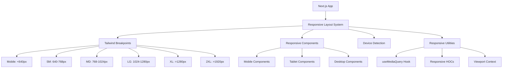

# System Design & Architecture

## Architecture Overview

**What is the high-level system structure?**



**Key components and their responsibilities:**

1. **Responsive Layout System**: Core wrapper that applies responsive classes and manages breakpoints
2. **Tailwind Breakpoints**: Standardized breakpoint system using Tailwind's default + custom breakpoints
3. **Responsive Components**: Component variants optimized for different screen sizes
4. **Device Detection**: Client-side hooks and utilities for detecting viewport size
5. **Responsive Utilities**: Helper hooks, HOCs, and context providers for responsive behavior

**Technology stack choices and rationale:**

- **Tailwind CSS**: Already in use, provides excellent responsive utilities with mobile-first approach
- **React Hooks (useMediaQuery)**: For dynamic responsive behavior in React components
- **CSS Container Queries**: For component-level responsiveness (progressive enhancement)
- **Next.js Image**: For responsive images with automatic optimization
- **Viewport Context**: For sharing responsive state across component tree

## Data Models

**What data do we need to manage?**

**Viewport State:**

```typescript
interface ViewportState {
  width: number
  height: number
  breakpoint: 'mobile' | 'sm' | 'md' | 'lg' | 'xl' | '2xl'
  isMobile: boolean
  isTablet: boolean
  isDesktop: boolean
  orientation: 'portrait' | 'landscape'
}
```

**Responsive Component Props:**

```typescript
interface ResponsiveProps {
  mobileVariant?: ReactNode
  tabletVariant?: ReactNode
  desktopVariant?: ReactNode
  breakpoint?: 'mobile' | 'sm' | 'md' | 'lg' | 'xl' | '2xl'
}
```

**No database schema changes needed** - this is purely a frontend implementation.

## API Design

**How do components communicate?**

**React Context API for Viewport:**

```typescript
// ViewportProvider context
const ViewportContext = createContext<ViewportState | null>(null)

// Usage
const { isMobile, isTablet, breakpoint } = useViewport()
```

**Custom Hooks:**

```typescript
// useMediaQuery hook
const isMobile = useMediaQuery('(max-width: 768px)')

// useBreakpoint hook
const breakpoint = useBreakpoint()

// useOrientation hook
const orientation = useOrientation()
```

**No external API changes needed** - existing APIs remain unchanged.

## Component Breakdown

**What are the major building blocks?**

### 1. Core Responsive Infrastructure

- `ViewportProvider` - Context provider for viewport state
- `useViewport` hook - Access viewport state
- `useMediaQuery` hook - Match media queries
- `useBreakpoint` hook - Get current breakpoint
- `ResponsiveContainer` - Wrapper component for responsive layouts

### 2. Responsive Layout Components

- `ResponsiveNavigation` - Adaptive navigation (hamburger on mobile, full menu on desktop)
- `ResponsiveSidebar` - Collapsible sidebar for tablet/mobile
- `ResponsiveHeader` - Adaptive header with different layouts per breakpoint
- `ResponsiveFooter` - Stacked footer on mobile, multi-column on desktop
- `ResponsiveGrid` - Auto-adjusting grid system

### 3. Responsive UI Components (shadcn/ui enhancements)

- `ResponsiveTable` - Data table with horizontal scroll or card layout on mobile
- `ResponsiveDialog` - Full-screen on mobile, centered on desktop
- `ResponsiveDropdown` - Bottom sheet on mobile, dropdown on desktop
- `ResponsiveCard` - Adaptive card layouts
- `ResponsiveTabs` - Scrollable tabs on mobile

### 4. Page-Level Responsive Layouts

- `MobileLayout` - Layout wrapper for mobile pages
- `TabletLayout` - Layout wrapper for tablet pages
- `DesktopLayout` - Layout wrapper for desktop pages
- `AdaptiveLayout` - Auto-switching layout based on viewport

### 5. Responsive Utilities

- `ResponsiveImage` - Wrapper around Next.js Image with responsive sizes
- `ResponsiveText` - Text with responsive sizing
- `ResponsiveSpacing` - Dynamic spacing utilities

## Design Decisions

**Why did we choose this approach?**

### Decision 1: Mobile-First CSS with Tailwind

**Choice**: Use Tailwind's mobile-first responsive utilities (`md:`, `lg:`, etc.)
**Rationale**:

- Already using Tailwind CSS
- Mobile-first ensures base styles work on smallest screens
- Easier to progressively enhance than to strip down desktop styles
  **Alternatives considered**: Desktop-first (rejected - harder to maintain)

### Decision 2: React Context for Viewport State

**Choice**: Use React Context + hooks for shared viewport state
**Rationale**:

- Avoids prop drilling
- Centralized viewport detection logic
- Efficient re-renders only for components that need viewport data
  **Alternatives considered**: Redux (overkill), local state in each component (inconsistent)

### Decision 3: CSS-First, JS for Complex Cases

**Choice**: Prefer CSS responsive utilities, use JS hooks only when necessary
**Rationale**:

- Better performance (no JS execution needed)
- Works even if JS is delayed or fails
- Simpler to maintain
  **Alternatives considered**: All-JS solution (worse performance)

### Decision 4: Component Variants vs Single Responsive Component

**Choice**: Single components with responsive CSS, variants only for drastically different layouts
**Rationale**:

- Reduces code duplication
- Easier to maintain single component
- Variants only when CSS alone is insufficient
  **Alternatives considered**: Separate mobile/desktop components (more duplication)

### Decision 5: Standard Tailwind Breakpoints + One Custom

**Choice**: Use Tailwind defaults + add 2xl for large screens
**Rationale**:

- Industry-standard breakpoints
- Well-documented and battle-tested
- Matches common device sizes
  **Breakpoints**:
- `mobile`: < 640px (default)
- `sm`: 640px - 768px
- `md`: 768px - 1024px
- `lg`: 1024px - 1280px
- `xl`: 1280px - 1920px
- `2xl`: > 1920px

## Non-Functional Requirements

**How should the system perform?**

### Performance targets

- No layout shifts during responsive transitions (CLS < 0.1)
- Responsive image loading with appropriate sizes per breakpoint
- Lazy loading for below-the-fold content on mobile
- Minimal JavaScript for responsive behavior (prefer CSS)
- Debounced window resize handlers (max 1 update per 150ms)

### Scalability considerations

- Responsive patterns should be reusable across all pages
- New components should follow responsive patterns by default
- Documentation for developers on implementing responsive components

### Security requirements

- No security implications (purely UI/layout changes)
- Ensure mobile forms have proper input validation
- Touch interactions should not bypass security measures

### Reliability/availability needs

- Responsive design should work even if JavaScript fails (CSS-first approach)
- Graceful degradation for older browsers
- No breaking changes to existing functionality

### Accessibility requirements

- Maintain WCAG 2.1 AA compliance across all breakpoints
- Touch targets minimum 44x44px on mobile/tablet
- Keyboard navigation works on all devices
- Screen reader compatibility maintained
- Focus management in responsive navigation components
