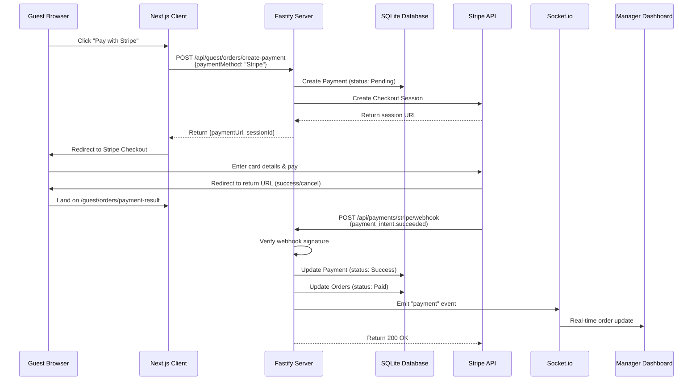

# System Design & Architecture: Stripe Payment Integration

## Architecture Overview

**What is the high-level system structure?**



### Key Components

1. **Client (Next.js)**: Payment method selector UI, redirect handler, result page
2. **Server (Fastify)**: Payment controller, Stripe integration, webhook handler
3. **Stripe SDK**: Official `stripe` npm package for API communication
4. **Database (SQLite)**: Payment and Order records with Stripe metadata
5. **Socket.io**: Real-time payment notifications to manager dashboard
6. **Stripe Dashboard**: Test mode monitoring and webhook management

### Technology Stack Rationale

- **Stripe Checkout**: PCI-compliant hosted page (no sensitive card data on our server)
- **Webhook-based confirmation**: Reliable payment verification (more secure than client-side)
- **Test Mode**: Safe development without real transactions
- **USD only**: Avoids currency conversion complexity (Stripe's native currency)

## Data Models

**What data do we need to manage?**

### Existing Payment Table (Prisma Schema)

The current schema already supports Stripe fields:

```prisma
model Payment {
  id                    Int       @id @default(autoincrement())
  guestId               Int?
  tableNumber           Int?
  amount                Int       // Amount in USD cents (e.g., 1050 = $10.50)
  paymentMethod         String    // "Stripe"
  status                String    @default("Pending") // "Pending" | "Success" | "Failed"
  transactionRef        String    @unique // Our internal ref: "PAY_<guestId>_<timestamp>"

  // Stripe-specific fields (already exist)
  externalTransactionId String?   // Stripe Payment Intent ID (pi_xxx)
  externalSessionId     String?   // Stripe Checkout Session ID (cs_xxx)
  paymentIntentStatus   String?   // "succeeded" | "canceled" | "failed"
  last4Digits           String?   // Last 4 digits of card
  cardBrand             String?   // "visa" | "mastercard" | "amex"

  // Common fields
  paymentUrl            String?   // Stripe Checkout URL
  returnUrl             String?   // Our return URL
  ipAddress             String?   // Guest IP
  currency              String?   @default("VND") // Change to "USD" for Stripe
  metadata              String?   // JSON: {stripeCustomerId, receiptUrl, etc.}
  description           String?   // "Payment $10.50 - 3 dishes - Guest Name"
  note                  String?   // Optional note

  paymentHandlerId      Int?
  createdAt             DateTime  @default(now())
  updatedAt             DateTime  @updatedAt
  paidAt                DateTime? // Timestamp of successful payment

  orders                Order[]
  paymentHandler        Account?  @relation(fields: [paymentHandlerId], references: [id])
  guest                 Guest?    @relation(fields: [guestId], references: [id])
}
```

### Data Flow

1. **Payment Creation**:
   - Guest requests payment → Create `Payment` with `status: "Pending"`
   - Store `externalSessionId` from Stripe
2. **Payment Completion**:
   - Stripe webhook fires → Update `Payment` with:
     - `status: "Success"`
     - `externalTransactionId` (Payment Intent ID)
     - `paymentIntentStatus: "succeeded"`
     - `last4Digits`, `cardBrand`
     - `paidAt: new Date()`
   - Update related `Orders` to `status: "Paid"`

3. **Metadata JSON Structure**:

```json
{
  "stripeCustomerId": "cus_xxx",
  "receiptUrl": "https://stripe.com/receipts/xxx",
  "paymentIntentId": "pi_xxx",
  "checkoutSessionId": "cs_xxx",
  "cardCountry": "US",
  "paymentMethodId": "pm_xxx"
}
```

## API Design

**How do components communicate?**

### 1. Create Payment Endpoint (Modified)

**Existing endpoint**: `POST /api/guest/orders/create-payment`

**Request Body**:

```json
{
  "paymentMethod": "Stripe",
  "currency": "USD",
  "note": "Optional note"
}
```

**Response** (when `paymentMethod: "Stripe"`):

```json
{
  "message": "Payment created successfully",
  "data": {
    "payment": {
      "id": 123,
      "transactionRef": "PAY_45_1699876543210",
      "amount": 1050,
      "currency": "USD",
      "status": "Pending",
      "externalSessionId": "cs_test_xxx"
    },
    "paymentUrl": "https://checkout.stripe.com/pay/cs_test_xxx",
    "sessionId": "cs_test_xxx"
  }
}
```

### 2. Stripe Checkout Return URL (New)

**Endpoint**: `GET /api/payments/stripe/return`

**Query Parameters**:

- `session_id`: Stripe Checkout Session ID
- `success`: `true` | `false` (optional, based on redirect)

**Behavior**:

1. Fetch session from Stripe API using `session_id`
2. Verify payment status
3. Redirect to client: `/guest/orders/payment-result?success=true&amount=1050&txnRef=PAY_45_xxx&method=Stripe`

**Response**: HTTP 302 Redirect

### 3. Stripe Webhook Endpoint (New)

**Endpoint**: `POST /api/payments/stripe/webhook`

**Headers**:

- `stripe-signature`: Webhook signature for verification

**Body**: Stripe Event Object (JSON)

**Handled Events**:

- `checkout.session.completed`: Payment intent created
- `payment_intent.succeeded`: Payment confirmed
- `payment_intent.payment_failed`: Payment failed

**Response**:

```json
{
  "received": true
}
```

**Security**: Verify webhook signature using `stripe.webhooks.constructEvent()`

### 4. Payment Detail Endpoint (Existing)

**Endpoint**: `GET /api/payments/:paymentId`

**Response** (includes Stripe metadata):

```json
{
  "message": "Get payment detail successfully",
  "data": {
    "id": 123,
    "amount": 1050,
    "currency": "USD",
    "paymentMethod": "Stripe",
    "status": "Success",
    "externalTransactionId": "pi_xxx",
    "externalSessionId": "cs_xxx",
    "cardBrand": "visa",
    "last4Digits": "4242",
    "paidAt": "2024-11-11T10:30:00Z",
    "orders": [...],
    "guest": {...}
  }
}
```

## Component Breakdown

**What are the major building blocks?**

### Backend Components

#### 1. Payment Controller (`server/src/controllers/payment.controller.ts`)

**New Functions**:

- `processStripePayment()`: Create Stripe Checkout session
- `verifyStripeWebhook()`: Handle and verify Stripe webhook events
- `getStripeSession()`: Fetch session details from Stripe

**Modified Functions**:

- `createPaymentController()`: Add Stripe case to payment method switch

#### 2. Stripe Utility (`server/src/utils/stripe.ts`) - **NEW FILE**

```typescript
// Initialize Stripe
import Stripe from 'stripe'
import envConfig from '@/config'

export const stripe = new Stripe(envConfig.STRIPE_SECRET_KEY, {
  apiVersion: '2024-11-20.acacia',
  typescript: true,
})

// Create Checkout Session
export const createStripeCheckoutSession = async ({
  amount, // in USD cents
  transactionRef,
  description,
  returnUrl,
  guestEmail,
}: {
  amount: number
  transactionRef: string
  description: string
  returnUrl: string
  guestEmail?: string
}) => {
  const session = await stripe.checkout.sessions.create({
    mode: 'payment',
    payment_method_types: ['card'],
    line_items: [
      {
        price_data: {
          currency: 'usd',
          unit_amount: amount,
          product_data: {
            name: 'Restaurant Order Payment',
            description,
          },
        },
        quantity: 1,
      },
    ],
    metadata: {
      transactionRef,
    },
    success_url: `${returnUrl}?session_id={CHECKOUT_SESSION_ID}&success=true`,
    cancel_url: `${returnUrl}?session_id={CHECKOUT_SESSION_ID}&success=false`,
    customer_email: guestEmail,
  })

  return session
}

// Verify Webhook
export const verifyStripeWebhook = (payload: string | Buffer, signature: string) => {
  return stripe.webhooks.constructEvent(payload, signature, envConfig.STRIPE_WEBHOOK_SECRET)
}
```

#### 3. Environment Config (`server/src/config.ts`)

**Add**:

```typescript
STRIPE_SECRET_KEY: z.string(),
STRIPE_WEBHOOK_SECRET: z.string(),
STRIPE_RETURN_URL: z.string().url()
```

#### 4. Payment Route (`server/src/routes/payment.route.ts`)

**Add**:

```typescript
// Stripe return URL
fastify.get('/stripe/return', async (request, reply) => {
  const { session_id } = request.query
  // Handle return logic
})

// Stripe webhook
fastify.post(
  '/stripe/webhook',
  {
    config: { rawBody: true }, // Important for signature verification
  },
  async (request, reply) => {
    // Verify and process webhook
  }
)
```

### Frontend Components

#### 1. Payment Method Selector (`client/src/app/[locale]/guest/orders/orders-cart.tsx`)

**Modifications**:

```tsx
<RadioGroup value={selectedPaymentMethod} onValueChange={setSelectedPaymentMethod}>
  <div className="flex items-center space-x-2">
    <RadioGroupItem value={PaymentMethod.Cash} id="cash" />
    <Label htmlFor="cash">💵 Cash Payment</Label>
  </div>
  <div className="flex items-center space-x-2">
    <RadioGroupItem value={PaymentMethod.VNPay} id="vnpay" />
    <Label htmlFor="vnpay">💳 VNPay (Auto convert to VND)</Label>
  </div>
  {/* NEW */}
  <div className="flex items-center space-x-2">
    <RadioGroupItem value={PaymentMethod.Stripe} id="stripe" />
    <Label htmlFor="stripe">💳 Stripe (Credit/Debit Card - USD)</Label>
  </div>
</RadioGroup>
```

#### 2. Payment Result Page (`client/src/app/[locale]/guest/orders/payment-result/page.tsx`)

**Modifications**: Already handles VNPay, extend to support Stripe query params

#### 3. Constants (`client/src/constants/type.ts` & `server/src/constants/type.ts`)

**Add**:

```typescript
export const PaymentMethod = {
  Cash: 'Cash',
  VNPay: 'VNPay',
  Stripe: 'Stripe', // NEW
} as const

export const PaymentMethodValues = ['Cash', 'VNPay', 'Stripe'] as const
```

## Design Decisions

**Why did we choose this approach?**

### 1. Stripe Checkout vs Payment Element

**Decision**: Use Stripe Checkout (redirect)
**Rationale**:

- ✅ Simpler integration (no frontend card element)
- ✅ PCI compliance handled by Stripe
- ✅ Mobile-optimized by default
- ✅ Supports multiple payment methods easily
- ❌ Less customization (but acceptable for MVP)

### 2. Webhook-based Confirmation

**Decision**: Use webhooks as source of truth, not client redirect
**Rationale**:

- ✅ More secure (client can't fake payment success)
- ✅ Handles edge cases (user closes browser before redirect)
- ✅ Stripe retries failed webhooks automatically
- ❌ Requires public HTTPS endpoint (use ngrok for local dev)

### 3. USD Cents Storage

**Decision**: Store amounts in cents (e.g., 1050 = $10.50)
**Rationale**:

- ✅ Avoids floating-point precision errors
- ✅ Matches Stripe's API format
- ✅ Consistent with VNPay (stores VND without decimals)

### 4. Test Mode Only

**Decision**: Use test API keys, defer production setup
**Rationale**:

- ✅ Safe experimentation
- ✅ No real money at risk
- ✅ Easy to test failure scenarios
- 🔄 Production setup requires business verification and live keys

### 5. Reuse Existing Payment Schema

**Decision**: Use current `Payment` table (already has Stripe fields)
**Rationale**:

- ✅ No database migration needed
- ✅ Schema was designed with flexibility
- ✅ Faster development

## Non-Functional Requirements

**How should the system perform?**

### Performance Targets

- **Checkout session creation**: < 2s (Stripe API call)
- **Webhook processing**: < 1s (database update + socket emit)
- **Page redirect**: < 500ms (client-side)

### Scalability Considerations

- Stripe handles payment processing load
- Webhook endpoint should handle concurrent requests (Fastify's async model)
- Database transactions prevent race conditions

### Security Requirements

1. **API Keys**: Store in environment variables (never commit to git)
2. **Webhook Signature**: Always verify `stripe-signature` header
3. **HTTPS Only**: Stripe requires HTTPS for webhooks (use ngrok for local dev)
4. **PCI Compliance**: No card data touches our server (Stripe Checkout handles it)
5. **CSRF Protection**: Webhook uses signature, not cookies/sessions

### Reliability/Availability

- **Webhook Retries**: Stripe retries failed webhooks for up to 3 days
- **Idempotency**: Use `transactionRef` to prevent duplicate payments
- **Error Logging**: Log all Stripe API errors (consider Sentry integration)
- **Fallback**: If webhook fails, guest can check payment status via Stripe session lookup

### Testing Strategy

- Use Stripe test card numbers (e.g., `4242 4242 4242 4242` for success)
- Test webhook locally with Stripe CLI (`stripe listen --forward-to localhost:4000/api/payments/stripe/webhook`)
- Simulate failures (declined cards: `4000 0000 0000 0002`)
